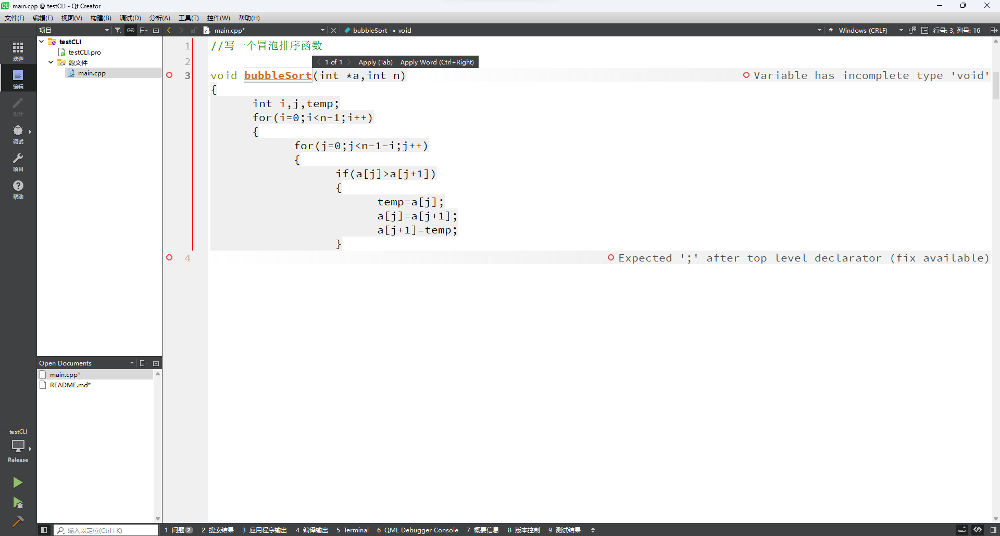

# CodeGeeX2-6B-QtCreator-Plugin
支持CodeGeeX2-6B模型的Qt Creator插件
# 简介
支持本地或网络部署的[CodeGeeX2-6B](https://github.com/THUDM/CodeGeeX2)模型。
目前不支持连接到[CodeGeeX官网](https://codegeex.cn/)。
参考了[Qt Creator源码](https://github.com/qt-creator/qt-creator)中的[Copilot插件](https://github.com/qt-creator/qt-creator/tree/master/src/plugins/copilot)。
# 安装
## 二进制安装
1. 在release中下载和你的Qt Creator版本完全一致的插件（看运气）。
2. 关闭Qt Creator。
3. 解压缩。假设你使用Linux，Qt Creator安装在/opt/Qt/Tools/QtCreator/，则解压命令参考：sudo tar -zxvf CodeGeeX2-2.0.0-QtCreator11.0.1-Qt6.4.3-GCC.tar.gz -C /opt/Qt/Tools/QtCreator/。
4. 打开Qt Creator。
## 编译源代码安装
### 需求
需要cmake、Qt开发环境、Qt Creator（确认安装时选中了Plugin Development）。
Qt Creator建议11.0及以上版本。Qt开发环境的版本需要与Qt Creator一致（Qt Creator里面“帮助”>“About Qt Creator”可以查看）。
### 步骤
以Linux为例，假设Qt和Qt Creator分别位于/opt/Qt/6.4.3/gcc_64、/opt/Qt/Tools/QtCreator目录。
1. mkdir build
2. cd build
3. cmake .. -DCMAKE_BUILD_TYPE=Release -DCMAKE_PREFIX_PATH="/opt/Qt/6.4.3/gcc_64;/opt/Qt/Tools/QtCreator" -DCMAKE_INSTALL_PREFIX=/opt/Qt/Tools/QtCreator
4. make
5. sudo make install
# 使用
首先部署好[CodeGeeX2-6B](https://github.com/THUDM/CodeGeeX2)模型。
启动CodeGeeX2-6B的Gradio DEMO（基本命令是python ./demo/run_demo.py，具体说明详见CodeGeeX2-6B模型的文档[启动 Gradio DEMO](https://github.com/THUDM/CodeGeeX2#%E5%90%AF%E5%8A%A8-gradio-demo)部分）。
注意：局域网部署CodeGeeX2-6B请加入“--listen 0.0.0.0”参数。另外，确保防火墙没有拦截服务。
在Qt Creator中选择“编辑”>“Preference”，找到“CodeGeeX2”项目，设置参数。局域网使用尤其注意修改IP设置。
设置完成后应该可以使用了。敲一段代码，停顿几秒（和你显卡性能及参数设置有关），会出现提示。
按“Tab”键接受，按“Ctrl+右”组合键接受一个单词。还有“接受一行”功能，目前只能鼠标点击，没有快捷键。

# 已知问题
1. 如果注释中左大括号和右大括号数量不一致，“大括号平衡”功能将无法正常工作。可以在设置中将其关闭。
